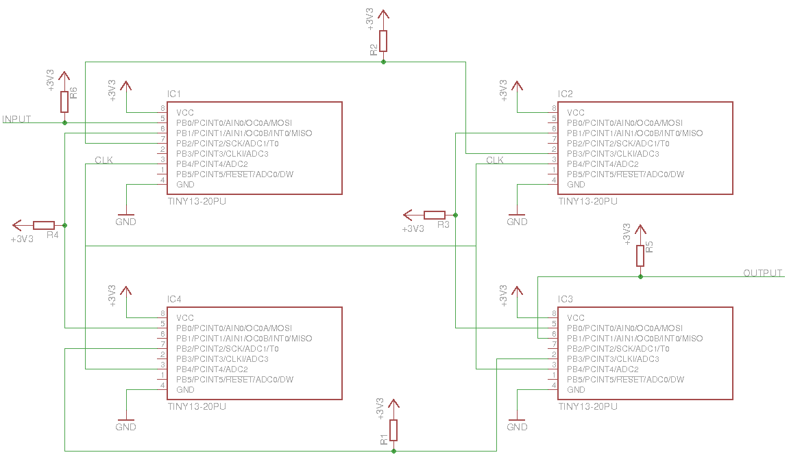

# TIS-AVR

An implementation of the TIS-100 architecture for a grid of Attiny25 and a Raspberry Pi.

A grid of Attiny25 chips talks to each other over a set of bi-directional busses to its neigbors, driven by a clock signal provided by a Raspberry Pi.

The Raspberry Pi can then send numbers to a node in the grid and read results from another node.

The nodes run a simple emulator for the TIS-100 assembly language.

## Differences from TIS-100

For one thing, it's less secure, less reliable and more 8-bit. There is nothing that stops you from overflowing your numbers or jumping to random memory.

It currently does not loop around, so you have to jump manually.

It's probably also more buggy, and timing might be different around sending/receiving data.

## Communication protocol

Did I mention the bi-directional bus?
The Attiny25 has 5(+reset) output pins, 4 to each neigbor and 1 to the shared clock line.
Every bus is pulled up with a 10k resistor, and pulled low to write.

Data is written in chunks of 10 bits, 2 negotiation bits and 8 data bist.
The first bit is the write bit, the second the read bit.
By sending a 0 you indicate you want to write.
Only if two maching 0 are exchanged does a transaction happen.

This means that like in TIS-100, two nodes wanting to write or read at the same time will deadlock sending, but not receiving 0.

Similarly, if one node writes a 0 to indicate reading or writing, but the other side sends a 1, nothing happens and the node spins untill a match is found.

## Schematic

## Future improvements

A convenient way is needed to program the chips. Currently you have to plug an SPI programmer into them one by one. It would be fairly easy to load code from the data bus, but some routing and forwarding needs to be done. The path could be included with the code, and every node strips a section of the path until the path is empty, then it is saved.
